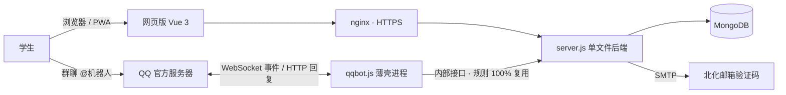

<div align="center">

&nbsp;&nbsp;

**不再一个人出发**

[](https://bhtx.prom1se.cn)
[](https://nodejs.org)
[](https://vuejs.org)
[](https://www.mongodb.com)
[](docs/qqbot-research.md)

</div>

---

百花同行是面向**北京化工大学学生**的校园互助拼车信息撮合平台。

**不派车、不抽成、不碰钱。** 平台只做一件事：让同路的人互相找到彼此。所有行程由学生自发发起、自行联系、共同呼叫正规网约车后分摊费用。

前身「百花同行」微信小程序（2026.4 – 2026.9，1300+ 用户、100+ 次真实拼成）因平台类目规则停止服务后，整个系统以网页 + QQ 群机器人的形态重建，撮合逻辑只保留一份实现。

## 功能

### 网页版（[bhtx.prom1se.cn](https://bhtx.prom1se.cn)）

- **邮箱验证码直登** —— 北化学号邮箱即身份，无需注册密码
- **同行大厅** —— 按日期、出发地筛选；游客可浏览
- **发布 / 加入 / 退出** —— 满员自动停止加入，出发后自动失效，退出自动补位
- **成员互看联系方式** —— 加入行程后与同车成员互相可见
- **车费结算** —— 按路线预估参考，实际车费由任意成员填写，人均自动分摊
- **我的行程** —— 发起人可标记完成、取消行程
- **PWA** —— 可添加到主屏幕
- **数据看板** —— 转化漏斗、按日趋势、撮合健康度、车费统计（[/dashboard](https://bhtx.prom1se.cn/dashboard)，管理密钥访问）

### QQ 群机器人

| 指令 | 说明 |
|---|---|
| `@机器人 明天下午四点 北化北区到北京南站` | 发布行程（自然语言，确认后生效） |
| `@机器人 查 明天` / `查 明天 北化北区` | 查询大厅行程 |
| `@机器人 加入 序号` | 加入查询结果中的行程 |
| `@机器人 我的` / `退出 序号` | 查看与退出进行中行程 |
| 私聊 `绑定 学号` | 邮箱验证码完成身份绑定 |
| 私聊 `联系方式 微信号` | 设置默认联系方式 |

主动通知：有人加入/退出时私聊行程全体成员、出发前 1 小时提醒、每日 9/12/15/18 点四次群内播报当日行程。

## 工作原理



- **身份锚点 = 北化邮箱**：`openid` 字段的值即学号邮箱，网页与 QQ 机器人共用同一条身份记录
- **撮合规则只有一份实现**：机器人通过内部接口以身份 JWT 自调用公开接口，限流、防超卖、并发上限等规则天然一致
- **脱敏三层**：大厅不下发身份字段；成员列表按是否同车决定可见性；联系方式仅成员互看
- **解析零依赖**：机器人自然语言解析为规则引擎（中文日期/时间/地点库），确定性输出、无幻觉、零成本

## 快速开始

```bash
git clone https://github.com/Prom1seCN/BHTX-web.git
cd BHTX-web
npm install
cp .env.example .env   # 填入 JWT_SECRET / SMTP_PASS / ADMIN_KEY 等
node --env-file=.env server.js
```

仅预览前端界面（无需 MongoDB）：

```bash
node dev-preview.js    # http://localhost:3001
```

## 部署

服务器（腾讯云轻量 · Ubuntu 22.04）上以 pm2 管理两个进程，**必须 fork 模式**（cluster 不传 `node_args`，`--env-file` 会静默失效）：

| 应用 | 说明 |
|---|---|
| `bhtxweb` | server.js，静态托管 + `/api/*`，端口 3100 |
| `bhtx-qqbot` | qqbot.js，WebSocket 接入 QQ 官方机器人 |

发布：`python tools/deploy.py <密码> upload && python tools/deploy.py <密码> start`（上传 → npm ci → node --check → pm2 reload → 健康检查与脱敏验证）。

## 仓库结构

```
├── server.js            # 单文件后端：撮合 / 脱敏 / 限流 / 埋点 / 邮件 / 内部接口
├── qqbot.js             # QQ 官方机器人：解析 / 会话 / 通知推送（薄壳）
├── public/              # 零构建前端：Vue 3 单页 + 数据看板 + PWA
│   ├── app.js / index.html / style.css
│   └── dashboard.html / dashboard.js / dashboard.css
├── deploy/              # pm2 配置 / 部署脚本 / 服务器环境模板
├── tools/               # deploy.py · shot.js · eval.js
└── docs/                # QQ 机器人接入调研
```

## 安全与隐私

- 教育邮箱验证保证校内身份；邮箱不予公开
- 联系方式仅同车成员互见，行程结束后停止展示
- 学号、联系方式等敏感信息不进入群聊天记录（机器人强制引导私聊）
- 行为埋点匿名统计、90 天自动过期
- 平台不收取任何费用、不经手资金，详见站内[隐私政策与用户协议](https://bhtx.prom1se.cn/#/legal)

## 相关文章

- [百花同行：复盘](https://prom1se.cn) —— 为什么学生要这么憋屈
- [百花同行：涅槃](https://prom1se.cn) —— 小程序之死与重建

---

<div align="center">

[Prom1seCN](https://github.com/Prom1seCN) · [prom1se.cn](https://prom1se.cn) · 浙ICP备2026023301号

</div>
