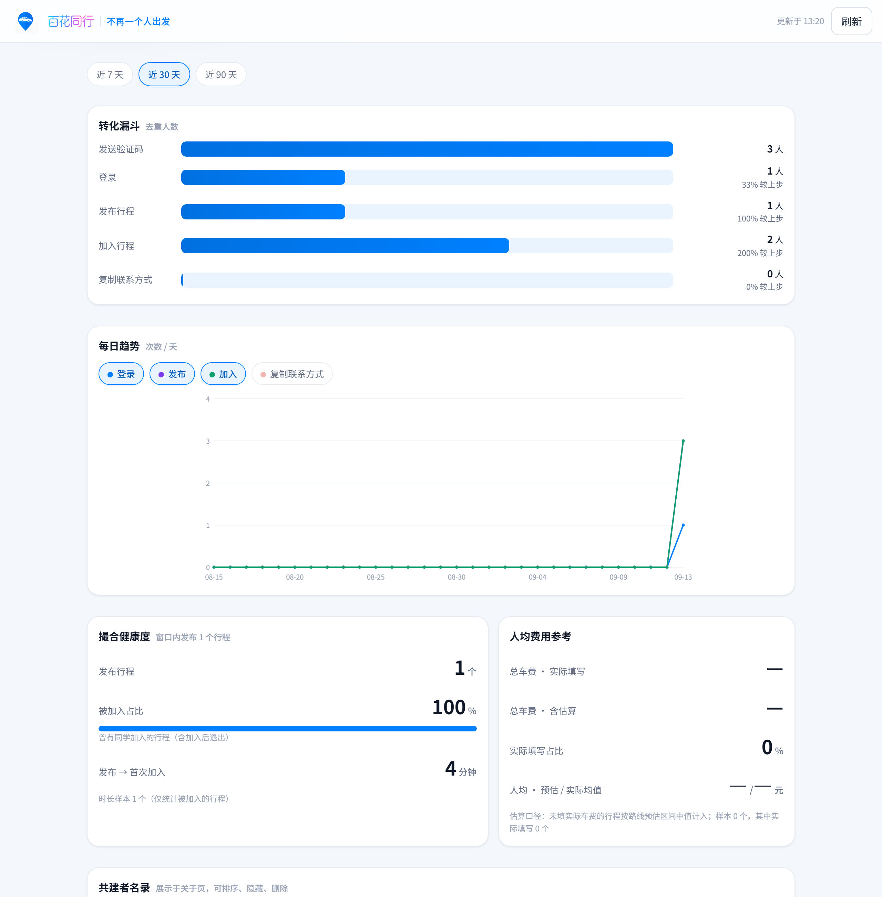
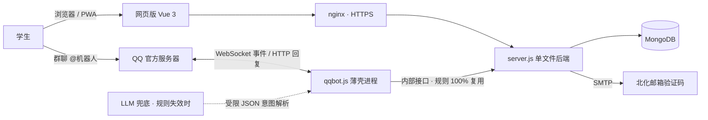

<div align="center">


**不再一个人出发**

[](https://bhtx.prom1se.cn)
[](https://nodejs.org)
[](https://vuejs.org)
[](https://www.mongodb.com)
[](docs/qqbot-research.md)

**面向北京化工大学学生的校园互助拼车信息撮合平台。**
不派车 · 不抽成 · 不碰资金 —— 只做一件事：让同路的人互相找到彼此。

[网页版](https://bhtx.prom1se.cn) · [QQ 群机器人](#-qq-群机器人) · [数据看板](#-数据看板) · [快速开始](#-快速开始) · [安全与隐私](#-安全与隐私)

</div>

---

小程序时代 1300+ 用户、100+ 次真实拼成。小程序停止服务后，整个系统以 **网页 + QQ 群机器人** 的形态重建：撮合体验全面升级，发布行程从填表变成说一句话。

## ✨ 它解决什么

校园拼车最难的不是找车，是**开口**。百花同行把整个流程压到最短：

1. 发一句「明天下午四点 北化北区到北京南站」—— 行程就挂上了
2. 同路的同学看到行程号，一句「加入 260914001」—— 上车
3. 加入后互看联系方式，出发前 1 小时机器人私聊提醒 —— 碰头
4. 坐完车任意成员填一下实际车费 —— 人均自动算好，结算通知发到每个人

**你只需要负责说话和坐车，剩下的交给机器人。**

## 🗣 QQ 群机器人

不用打开任何 App，在群里 @机器人 就能完成一切：

| 你说 | 机器人做 |
|---|---|
| 明天下午四点 北化北区到北京南站 | 解析并创建行程（确认后发布） |
| 查 明天 / 查 明天 北化北区 | 列出班次、余位与行程号 |
| 加入 行程号 或 序号 | 上车 |
| 退出 行程号 或 序号 | 下车 |
| 我的 | 查看进行中的行程 |
| 完成 行程号 | 发起人标记完成（出发后可用） |
| 取消行程 行程号 | 发起人取消，全员收到通知 |
| 车费 行程号 金额 | 成员填写实际车费 |
| 通知 行程号 | 提醒同车成员保持联系 |
| 播报 | 把你的行程播报到所有群（每日 2 次） |
| 私聊：绑定 学号 | 邮箱验证码完成身份绑定 |

时间说法随意：「明早八点」「周六下午」「晚上九点半」都能听懂。规则接不住的口语，还有免费 LLM 兜底理解。

## 🔔 全自动提醒

- 有人加入 / 退出 → **私聊通知行程全体成员**
- 出发前 1 小时 → 私聊提醒全车成员
- 每日 9 / 12 / 15 / 18 点 → 群内播报当日待出行程
- 行程完成结算 → 车费人均自动算好，通知到每个人

## 📊 数据看板

- **数据看板** [`/dashboard`](https://bhtx.prom1se.cn/dashboard)（管理密钥访问）：转化漏斗、按日趋势、撮合健康度（被加入占比、平均成行时长）、车费统计
- **管理界面** [`/manage`](https://bhtx.prom1se.cn/manage)：共建者名录管理、赞助收款码上传、赞助申请审核

<div align="center"></div>

## 🧭 发布即推荐

发布行程的瞬间，系统自动匹配**相近到达地点 + 相近出发时间**的其他行程（如乐多港万达 ↔ 昌平西山口互为相近），附在发布回执里——重复发车之前，先给你一次拼上已有车的机会。

## 🛠 技术栈与架构

零构建前端（Vue 3 单页）+ 单文件后端（Node 20 / Express / Mongoose）+ QQ 官方机器人（WebSocket）。撮合规则只保留一份实现：机器人通过内部接口以身份凭证自调用公开接口，网页与机器人的限流、防超卖、脱敏天然一致。



## 🚀 快速开始

```bash
git clone https://github.com/Prom1seCN/BHTX-web.git
cd BHTX-web
npm install
cp .env.example .env   # 填入 JWT_SECRET / SMTP_PASS / ADMIN_KEY 等
node --env-file=.env server.js
```

仅预览前端界面（无需 MongoDB）：

```bash
node dev-preview.js    # http://localhost:3001
```

## 📦 部署

服务器（腾讯云轻量 · Ubuntu 22.04）以 pm2 管理两个进程，**必须 fork 模式**（cluster 不传 `node_args`，`--env-file` 会静默失效）：

| 应用 | 说明 |
|---|---|
| `bhtxweb` | server.js，静态托管 + `/api/*`，端口 3100 |
| `bhtx-qqbot` | qqbot.js，WebSocket 接入 QQ 官方机器人 |

发布：`python tools/deploy.py <密码> upload && python tools/deploy.py <密码> start`（上传 → 依赖安装 → 语法检查 → pm2 reload → 健康检查与脱敏验证）。

## 🛡 安全与隐私

- 教育邮箱验证保证校内身份；邮箱不予公开
- 联系方式仅同车成员互见，加入行程前强制登记
- 学号、联系方式等敏感信息不进入群聊天记录（机器人强制引导私聊）
- 行为埋点匿名统计、90 天自动过期
- 平台不收取任何费用、不经手资金，详见站内[隐私政策与用户协议](https://bhtx.prom1se.cn/#/legal)

## 📝 相关文章

- [百花同行：复盘](https://prom1se.cn) —— 为什么学生要这么憋屈
- [百花同行：涅槃](https://prom1se.cn) —— 小程序之死与重建

---

<div align="center">

**Prom1seCN** · [prom1se.cn](https://prom1se.cn) · 浙ICP备2026023301号

</div>
